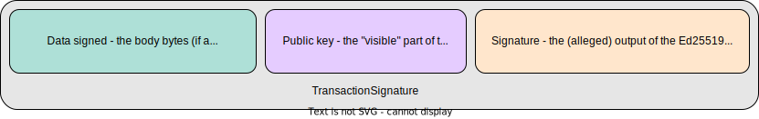

# Hedera keys and signatures

The standard security model has three dimensions:
  1. **Identity** - whatever distinguishes one agent (user, group, service account, etc.) from another.
  2. **Authentication** - the challenge task(s) an agent must perform to prove its identity.
  3. **Authorization** - which actions become permissible after proving a particular identity.

There are two kinds of agents in a Hedera network: _user accounts_ and _smart contracts_. Hedera 
identifies each agent in a shard by a unique positive _id_ such as `123456`. The next available 
id increases with each created entity. 

:notebook: It is important to understand that the ledger has non-agent entities, including files, 
NFTs, tokens, token associations, topics, and scheduled transactions. Each has an id, and actions 
on these entities always require authorization. But they are not agents, because they cannot 
_initiate_ any action. Only user accounts and smart contracts are agents.

So far, so good! But authentication and authorization are more entangled than you may expect from 
the standard model; and there are fundamental differences in how the Hedera model plays out for 
the two types of agents. Let us see why.

## Complex keys

We will uncover the power (and subtlety) of the Hedera security model as we start to arrange simple 
keys first into lists, and then into tree-like hierarchies of keys. But it is best to begin with 
quick review of some key ideas from cryptography.

### Public-key cryptography

[Public-key cryptography](https://en.wikipedia.org/wiki/Public-key_cryptography) underpins security
in every public ledger. Hedera supports two kinds of public-key cryptography: EdDSA, specifically 
[Ed25519](https://en.wikipedia.org/wiki/EdDSA#Ed25519); and [ECDSA](https://en.wikipedia.org/wiki/Elliptic_Curve_Digital_Signature_Algorithm), 
specifically using the Keccak-256 (SHA-3) hash and secp256k1 curve as on the Ethereum blockchain.

We do not need a deep understanding of public-key cryptography to be effective Hedera developers.
But we must deeply appreciate the basic recipe _for_ a cryptographic signature, as below:



There are three ingredients, which for our purposes are:
  1. Some bytes that encode an action in a secured system. 
  2. A public key linked to one or more entities in the system.
  3. A signature on the action bytes, claimed to have been done with the matching private key.

Given these ingredients, the magic of cryptography can resolve the signature to `VALID` or
`INVALID`; where for all practical purposes, we can treat it as impossible to get a `VALID`
signature without owning the private key.

:bulb: It is hard to overstate the importance of a clear mental model here.

### Cryptographic keys and the standard model 

The simplest way to implement a security model with cryptographic keys is for each agent or 
entity on a blockchain to have a single controlling key; and for its identity to be **determined 
by that key**. For example, Wikipedia explains that [on Ethereum](https://en.wikipedia.org/wiki/Ethereum#Addresses),
```
Ethereum addresses are composed of the prefix "0x" (a common identifier for hexadecimal) concatenated 
with the rightmost 20 bytes of the Keccak-256 hash of the ECDSA public key (the curve used is the 
so-called secp256k1).
``` 

So suppose we have a a 33-byte compressed ECDSA(secp256k1) public key `K`. It maps to a 20-byte address 
`0xab...cd`. If any agent `A` can manage to produce a valid signature on an Ethereum transaction with public 
key `K` as the second ingredient, that's enough for us to judge that `A` has authenticated itself for the 
`0xab...cd` identity. We can then authorize the submitted transaction to spend any and all of the assets owned 
by the account at the `0xab...cd` address. 

...
